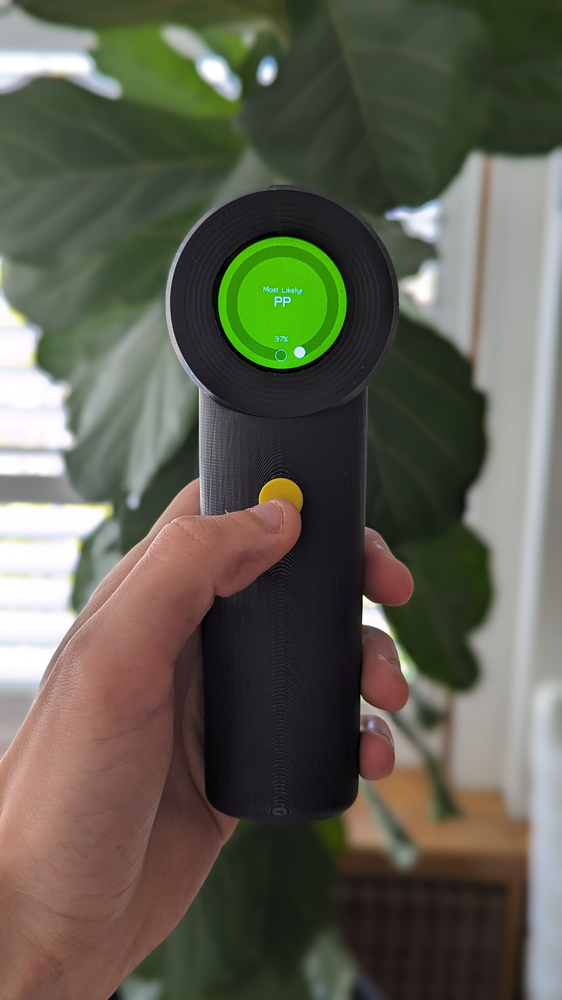
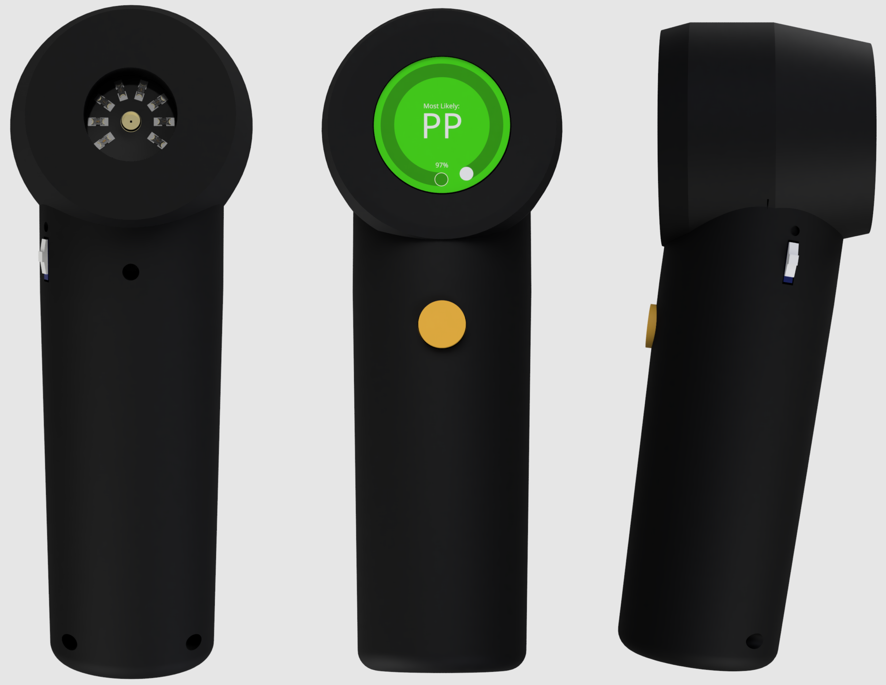
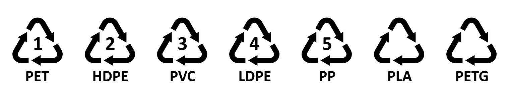
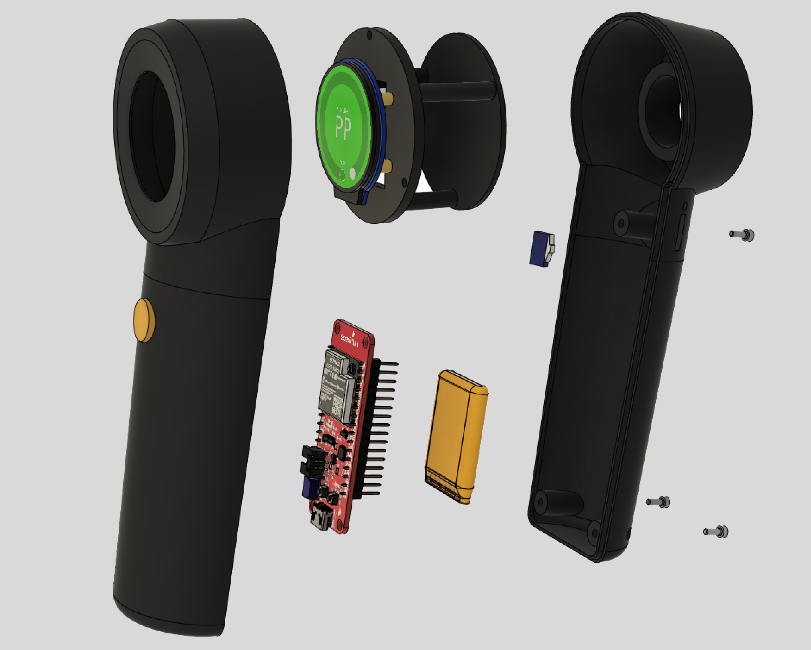

# Plastic Scanner

  
  

## Background
This repo contains the complete work of my Engineering Honours Thesis, 'A Low Cost, Handheld Plastic Identification Device'. This was a continuation of the work produced by the open-source project [Plastic Scanner](https://github.com/Plastic-Scanner). The scanner outlined in this repo can be considered an equal or successor to the [DB2](https://github.com/Plastic-Scanner/DB2.x-Hardware), as this version was used a baseline for the design. This scanner is functional and could be repoduced for testing and development purposes, however it is not adviced to use it in any commercial application. Further development is still needed to improve the reliability of the ML model and the mechanical design.

  

## Introduction
The plastic scanner is a handheld device that utilises cheap Infrared (IR) spectroscopic components and a machine learning model to identify plastic polymer types. The device is capable of identifying 7 types of plastics, with a real world accuracy of >80%.

##### Identifiable Plastics

There are some limitations on what it can identify. The scanner is either unable to or struggles to identify plastics that are overly dark/black, very dirty, contain excessive additives, clear or simply too different from the plastic types that were used to train the ML model.

## How it works
The scanner works by leveraging principles of [Infrared Spectroscopy](https://en.wikipedia.org/wiki/Infrared_spectroscopy). IR light is shone onto a plastic sample from discrete IR LEDs, the reflected light intensity is measured with an IR photodiode and these value are passed into an ML model for classification. 

**add flow chart here**

**Hardware** 
The custom PCB was designed using EasyEDA, the BOM and GRBL files needed to replicate the board are stored in [hardware/scanninig_PCB](hardware/scanninig_PCB). The structure of the scanner was made in Fusion360 and the CAD files are available.

As a brief overview, the device is comprised of the following parts:
- 3D printed enclosure
- Custom scanning PCB
- ESP-32 microcontroller
- 1.28inch Waveshare touchscreen LCD
- 600mAh battery
- Button, switch, USB Typc-C port and fasteners 

  

&nbsp;

**Software** 
The device itself is controlled by an ESP-32, which was programmed using the PlatformIO IDE and Arduino. Arduino was chosen to gain access to libraries for the LCD screen and simplify development. The code and documentation for for the embedded part of this projet can be found in [software/embedded_pio](software/embedded_pio).

The ML model was developed using Tensorflow and Jupyter notebook in a Ubuntu 22.04 docker container. All the data, models and documentation needed for this project is stored in [software/ml_model](software/ml_model/).