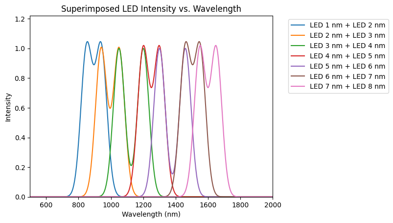

# Plastic Scanner

  
  

## Background
This repo contains the complete work of my Engineering Honours Thesis, 'A Low Cost, Handheld Plastic Identification Device'. This was a continuation of the work produced by the open-source project [Plastic Scanner](https://github.com/Plastic-Scanner). The scanner outlined in this repo can be considered an equal or successor to the [DB2](https://github.com/Plastic-Scanner/DB2.x-Hardware), as this version was used a baseline for the design. This scanner is functional and could be repoduced for testing and development purposes, however it is not adviced to use it in any commercial application. Further development is still needed to improve the reliability of the ML model and the mechanical design.

  

## Introduction
The plastic scanner is a low-cost, handheld device that utilises cheap Infrared (IR) spectroscopic components and a machine learning model to identify plastic polymer types. The device is capable of identifying 7 types of plastics, with a real world accuracy of >80%.

##### Identifiable Plastics

  

There are some limitations on what it can identify. The scanner is either unable to or struggles to identify plastics that are overly dark/black, very dirty, contain excessive additives, clear or simply too different from the plastic types that were used to train the ML model. For more information on this and much more, checkout [www.plasticscanner.com](www.plasticscanner.com)

## How it works
The scanner works by leveraging principles of [Infrared Spectroscopy](https://en.wikipedia.org/wiki/Infrared_spectroscopy). Plastic polymers tend to have a fairly unqiue reflected waveforms in the IR spectrum, meaning that plastic can be identified/classified by through analysis of these waveforms. The traditional method of achieving this is by using expensive optical filters to obtain the whole reflected intensity waveform. The plastic scanner uses a different approach, it uses relatively inexpensive IR LEDs and a photodiode to obtain the reflected intensities at just a few points. 

  

One at a time, each IR LED is shone onto a plastic sample and an IR photodiode will measure the intensity of the reflected light off of the plastic sample. These 8 intenisty values (one for each LED) can then be fed into an ML model for classification. A novel improvement that this thesis project introduced was to also shine adjacent LEDs at the same time, at half brightness. The light from these two LEDs would then superimpose and provide an additional 7 intensity values, which further improved the accuracy and reliability of the device.

  
  

To identify a piece of plastic, you hold it upto the back of the device (where the LEDs and photodiode is) and press the button. The device will then capture the intensity values, pass them to the ML model and the model will return what it thinks the plastic type most likely is. The round LCD screen on the device will display the predicted polyme type, as well as the associatied percentage likelihood. The following is the 'display guide' for discerning confidence levels.

  

## Hardware
The custom PCB was designed using EasyEDA, the BOM and GRBL files needed to replicate the board are stored in [hardware/scanninig_PCB](hardware/scanninig_PCB). The structure of the scanner was made in Fusion360 and the CAD files are available. As a brief overview, the device is comprised of the following parts:
- 3D printed enclosure
- Custom scanning PCB
- ESP-32 microcontroller
- 1.28inch Waveshare touchscreen LCD
- 600mAh battery
- Button, switch, USB Typc-C port and fasteners 

  
   

&nbsp;

## Software
The device itself is controlled by an ESP-32, which was programmed using the PlatformIO IDE and Arduino. Arduino was chosen to gain access to libraries for the LCD screen and simplify development. The code and documentation for the embedded part of this projet can be found in [software/embedded_pio](software/embedded_pio).

The ML model was developed using Tensorflow and Jupyter notebook in a Ubuntu 22.04 docker container. The model developed for this project is a 3-layer feed forward neural network, with ReLU activation. All the data, models and documentation for this project are stored in [software/ml_model](software/ml_model/).