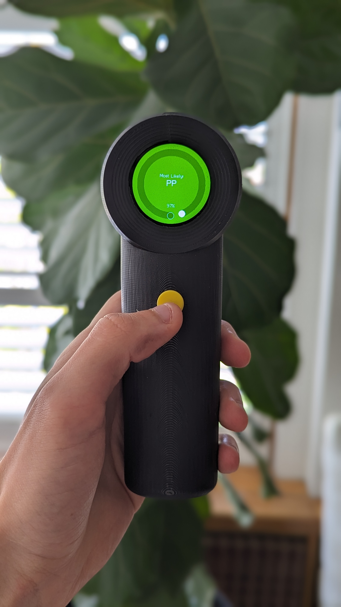

# Plastic Scanner

  
  

## Overview
This repo contains the completed work of my 'Engineering Bachelours Honours Thesis', which was a 'Low Cost, Handheld Plastic Identification Device'. It is a 'derived project' of the [Plastic Scanner](https://github.com/Plastic-Scanner) project. It was done this way rather than a direct fork to make it easier to make improvements to the design/architecture.